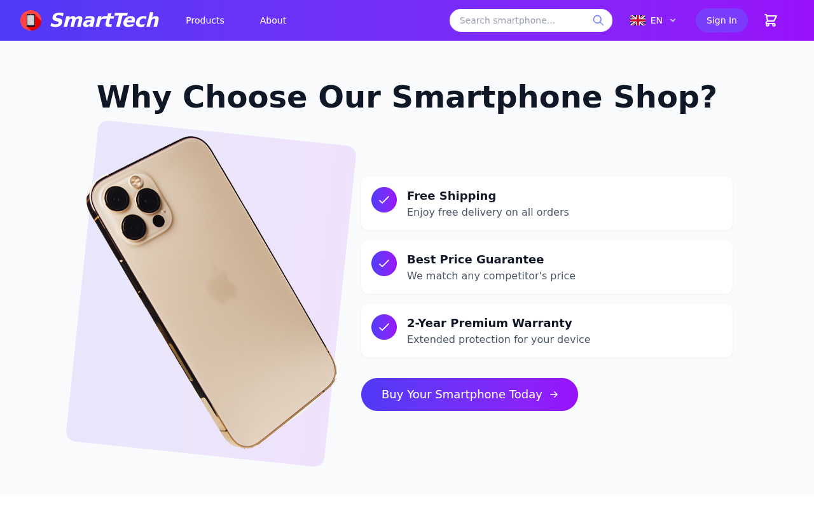
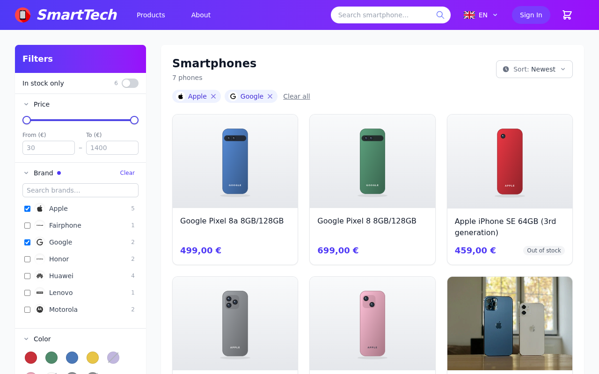
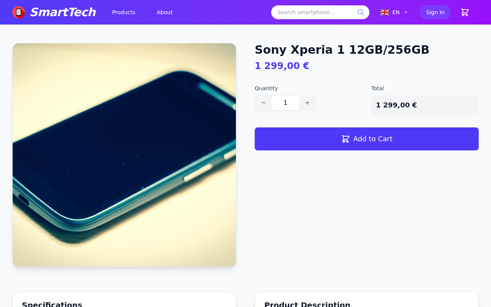
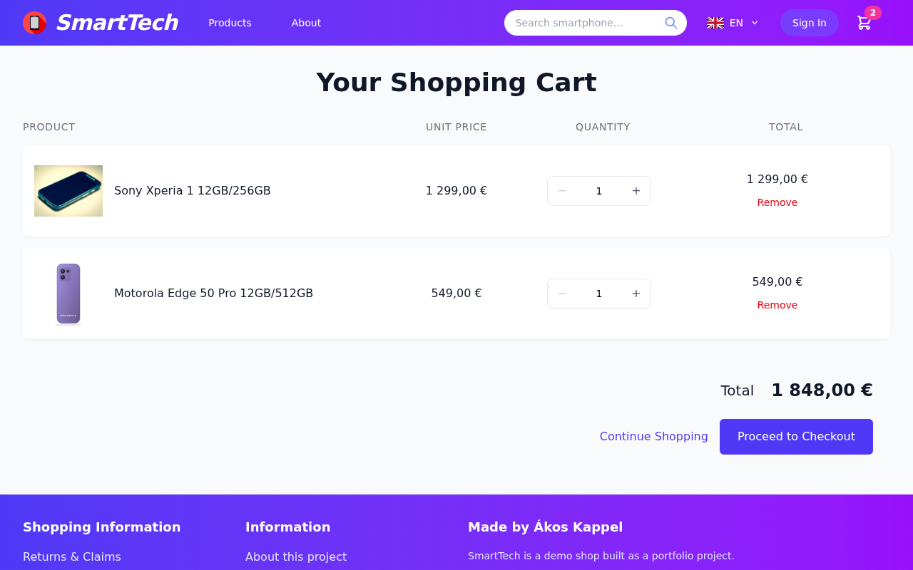
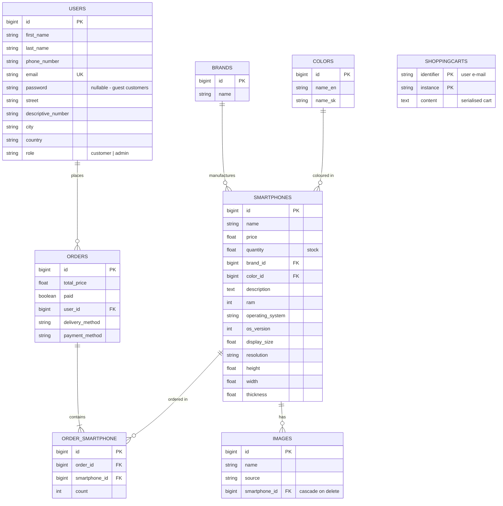

<div align="center">


# SmartTech – Smartphone E-shop

A full-stack, server-side rendered e-commerce web application for selling smartphones,
built with **Laravel 8**, **PostgreSQL** and **Tailwind CSS**.


**Live demo:** [akap-ntbk.tailb52c43.ts.net/wtech](https://akap-ntbk.tailb52c43.ts.net/wtech)<br>
<sub>Self-hosted on a home server, so it may occasionally be offline.</sub>

</div>

---

## Table of Contents

- [About the Project](#about-the-project)
- [Academic Context](#academic-context)
- [The Assignment](#the-assignment)
- [Features](#features)
- [Screenshots](#screenshots)
- [Tech Stack](#tech-stack)
- [Data Model](#data-model)
- [Design Decisions](#design-decisions)
- [Implementation Highlights](#implementation-highlights)
- [Project Structure](#project-structure)
- [Getting Started](#getting-started)
- [Routes Overview](#routes-overview)
- [Project History](#project-history)
- [What I Learned](#what-i-learned)
- [Author](#author)
- [License](#license)

---

## About the Project

**SmartTech** is an online store for smartphones. It covers the whole shopping flow:

- browsing a catalog you can filter and search,
- viewing product details,
- managing a shopping cart that is kept across sessions,
- a three-step checkout with delivery and payment selection, which works with or without an account.

A separate, role-protected **admin zone** lets administrators manage the catalog, including uploading and deleting product images.

The whole application is rendered on the server using Laravel's Blade templates. JavaScript is used only for small UI improvements such as quantity selectors, image switching and the mobile menu.

## Academic Context

I built this project as the semester project for **Web Technologies (WTECH)** in the 2nd year of my Bachelor's studies at the
[Faculty of Informatics and Information Technologies, Slovak University of Technology in Bratislava](https://www.fiit.stuba.sk/)
(_Fakulta informatiky a informačných technológií STU v Bratislave_), winter semester **2021/2022**.

It was my **first project with Laravel**, and my introduction to MVC frameworks, the Eloquent ORM, migrations, authentication and server-side rendering in PHP.

## The Assignment

The goal was to build an e-shop in a domain of our choice that covers a defined set of use cases. The work was done in pairs over the semester and split into three graded phases. The recommended stack was **Laravel** with **PostgreSQL**.

### Phases

| Phase | Deadline | Deliverable | Points |
|---|---|---|---|
| **1. Sketches** | 10 Oct 2021 | Wireframes for every page, for extra-large (desktop) screens | 8 |
| **2. Templates & data model** | 7 Nov 2021 | Responsive HTML/CSS templates for every use case (16 pts), logical data model as a UML class diagram (2 pts) | 18 |
| **Checkpoint** | 15–16 Nov 2021 | Working customer-facing part, demonstrated live (pass/fail) | 4 |
| **3. Implementation** | 5 Dec 2021 | Server-side rendered customer-facing part and admin zone in Laravel, complete database (schema and data), final documentation | 20 |

Phase 2 was graded on template coverage, responsive design, correct use of HTML5 semantic elements, code formatting and naming consistency, and the quality of the logical data model.

### Required Use Cases

**Customer side**

- Product listing for a category, with:
  - filtering by at least 3 attributes (e.g. price range, brand, colour)
  - pagination
  - sorting (e.g. by price, ascending or descending)
- Product detail page, with adding any quantity to the cart
- Full-text search over the product catalog
- Shopping cart:
  - change the quantity of a product and remove products
  - choose delivery and payment
  - enter delivery details (with validation)
  - complete the order
  - **order without logging in** (guest checkout)
  - **keep the cart across sessions** for logged-in users
- Customer registration, login and logout

**Admin side**

- Admin login and logout, allowed only for users with the `ADMIN` role
- Product list
- Create a product, with image upload and at least one lookup list (e.g. choose a colour from a `<select>`)
- Edit a product, with image upload and a list of existing images that can each be removed
- Delete a product, which also deletes its image files from disk

### Documentation Requirements

The final submission had to include:

- the physical data model,
- the design decisions made (e.g. why each external library was added, how roles were handled),
- a short description of how the key use cases were implemented (changing quantity, login, search, adding to cart, pagination, filtering),
- screenshots of the homepage, product detail, login and cart.

The sections below cover the same topics.

## Features

### Storefront
- **Homepage** with randomly picked recommended phones and a brand showcase
- **Product catalog** with 12 products per page and pagination that keeps the current query string
- **Filtering** by price range (min/max), several brands and several colours at once
- **Sorting** by price, cheapest or most expensive first
- **Full-text search** across product name, description and operating system, available from the header on every page
- **Product detail** page with technical specs (RAM, OS and version, display size, resolution, dimensions), an image gallery, and a quantity selector that updates the total price live

### Cart & Checkout
- **Session-based cart**: add, update quantity (limited to available stock) and remove items
- **Cart kept across sessions**: the cart is saved to the database on logout and restored on login
- **Three-step checkout**: delivery address, then delivery method, then payment method
  - Delivery: courier, personal pickup, post office, parcel locker
  - Payment: cash on delivery, bank transfer, credit card, Apple Pay, Google Pay (simulated; no real payment is taken)
- **Order confirmation page** with the order number, items at the prices paid, total, delivery and payment details. Guests who ticked "create an account" can set a password right there
- **Guest checkout**, with the option to turn the guest into a registered account after ordering
- **Stock tracking**: available quantities are reduced when an order is placed

### User Accounts
- Registration, login, logout and password reset, built on Laravel Breeze
- **Profile page** for editing personal and address details, which are used to pre-fill checkout
- **Password change**, checked against the current password with a custom validation rule
- Login and logout events are written to the application log

### Admin Zone
- Protected by an `isAdmin` gate and a `SmartphonePolicy`
- Product list sorted alphabetically, with pagination
- **Create and edit** products, with brand and colour chosen from lookup lists
- **Upload several images** at once, processed with Intervention Image
- Remove individual images when editing a product
- Deleting a product also **deletes its image files** from disk

### Languages
- The whole shop is available in **English, German and Slovak**: interface, info pages, validation messages, e-mails and product descriptions
- A **language switcher with flags** in the header; the choice is remembered in a cookie, and first-time visitors get their browser's language if it's supported
- Product descriptions are stored per language (the admin form has a field for each), falling back to English
- `php artisan lang:missing` lists any texts that still need a translation

### Demo Mode
- A **demo notice** on every page, plus About, Contact, Terms, Privacy and fictional shop-policy pages
- Author and profile links configured through `DEMO_*` variables in `.env`
- **Nightly reset** (`php artisan demo:reset`): rebuilds the database from the seeders, removes uploaded images, and clears sessions and caches, run by Laravel's scheduler in its own container

## Screenshots

> Screenshots will be added soon.

| Homepage | Product Catalog |
|---|---|
|  |  |

| Product Detail | Shopping Cart |
|---|---|
|  |  |

| Login | Admin Panel |
|---|---|
|  |  |

## Tech Stack

| Layer | Technology |
|---|---|
| **Backend** | PHP 8.1, Laravel 8 (MVC, Eloquent ORM, Blade) |
| **Database** | PostgreSQL 15 |
| **Frontend** | Blade templates, Tailwind CSS 2, Alpine.js 3, vanilla JavaScript |
| **Auth** | Laravel Breeze (customised), Gates & Policies |
| **Build** | Laravel Mix (webpack), PostCSS, Autoprefixer |
| **Infrastructure** | Docker Compose (PHP-FPM, Nginx, PostgreSQL) |

**Additional packages**

| Package | Purpose |
|---|---|
| [`hardevine/shoppingcart`](https://github.com/hardevine/LaravelShoppingcart) | Cart logic kept in the session, and saved to / restored from the database |
| [`intervention/image`](https://image.intervention.io/) | Processing and saving uploaded product images |
| [`laravelcollective/html`](https://laravelcollective.com/) | Form helpers used in the admin forms |
| [`laravel/breeze`](https://github.com/laravel/breeze) | Starting point for authentication (login, registration, password reset) |
| [Laravel-Lang](https://github.com/Laravel-Lang/lang) 8.1.3 (MIT) | German and Slovak validation, auth, password and framework messages (copied into `resources/lang`) |
| [flag-icons](https://github.com/lipis/flag-icons) 7.5.0 (MIT) | Flags in the language switcher (`public/images/flags`) |

## Data Model

Physical data model of the application's own tables. Framework tables such as `password_resets`, `failed_jobs`, `sessions` and `personal_access_tokens` are left out.



The database is filled by seeders with **13 brands** (Samsung, Apple, Xiaomi, Huawei, Google, Sony, Nokia, Lenovo, OnePlus, Motorola, Honor, Fairphone, Nothing), **9 colours** and **41 smartphones** from 2019–2024, including out-of-stock and low-stock items. The 19 original phones use product photos; the newer ones use generated SVG illustrations in each phone's colour (`public/images/products/`). Brand logos come from [Simple Icons](https://simpleicons.org/) (CC0) in `public/images/brands/`, and brands without a logo fall back to their first letter. [`sql/database.sql`](sql/database.sql) is the original 2021 SQL seed and only contains the first catalog.

## Design Decisions

- **Server-side rendering with Blade.** The assignment required it. Each page is built from shared partials (`head`, `header`, `footer`, `pagination`), so the layout stays the same everywhere.
- **Roles as a column, not a permissions system.** Each user has a `role` field (`customer` or `admin`). Access is checked by a single `isAdmin` gate and a `SmartphonePolicy`. With only two roles, a full roles-and-permissions package would have added complexity for no benefit.
- **Guest customers are regular users.** `users.password` is nullable. A guest who places an order is saved as a user without a password, so every order links to a user record with the delivery details. The guest can then register afterwards without typing their details again.
- **Using a cart package.** `hardevine/shoppingcart` provides a tested session cart with row IDs, quantities and totals. It can also save a cart to the database under an identifier, which was exactly what the "keep the cart across sessions" requirement needed.
- **Lookup tables for brands and colours.** They support the filters and the admin `<select>` lists. Colours are stored in English and Slovak to support both UI languages.
- **Images on disk, paths in the database.** Uploaded images go to `public/images/` with predictable names (`smartphone-{id}-{n}.{ext}`). The `images` table stores only their paths, which makes it easy to delete the files later.
- **PostgreSQL.** This was the recommended database for the course. The search uses PostgreSQL's case-insensitive `ILIKE`.

## Implementation Highlights

### Filtering, Sorting & Pagination
Filters are written as reusable **Eloquent query scopes** on the `Smartphone` model (`minPrice`, `maxPrice`, `ofBrand`, `ofColor`). The controller applies only the filters present in the request, then sorts and paginates:

```php
if ($request['min-price']) {
    $smartphones = $smartphones->minPrice($request['min-price']);
}
// ... max price, brands, colours ...
$smartphones = $smartphones->orderBy('price', $sort)->paginate(12);
```

In the view, the pagination links are rendered with `withQueryString()` and a custom Blade template, so the active filters, search term and sort order are kept when moving between pages.

### Full-text Search
The search box in the header sends a `search` query parameter to the catalog. That parameter becomes a case-insensitive `ILIKE` match across `name`, `description` and `operating_system`.

### Adding to Cart & Changing Quantity
On the product detail page, a small script (`public/js/details.js`) drives a +/− quantity selector, updates the total price live and switches between product images. When the form is submitted, the item is added to the session cart through `Cart::add()`. In the cart, changing a quantity submits the form automatically (`public/js/cart.js`). The quantity cannot go above the stock available, and the server applies it with `Cart::update($rowId, $qty)`.

### Keeping the Cart Across Sessions
The login and logout actions in Breeze were extended:

```php
// on logout – save the session cart under the user's e-mail
Cart::store(Auth::user()->email);

// on login – restore it
Cart::restore(Auth::user()->email);
```

So a customer can add items, log out, log in again later or on another device, and find the same cart.

### Login & Roles
Authentication is built on Laravel Breeze, with the views redesigned to match the shop. Successful logins and logouts trigger event listeners (`LogSuccessfulLogin`, `LogSuccessfulLogout`) that write to the application log. The admin area uses the `auth` and `can:isAdmin` middleware, and admin-only controls in the views are wrapped in `@can` directives.

### Checkout
The three checkout steps (address, delivery, payment) each validate their input. For a logged-in user, the details are saved to their profile; for a guest, to the session. The final step, in one pass:

1. finds or creates the customer,
2. creates the `Order`,
3. attaches the ordered phones through the `order_smartphone` pivot table with their quantities,
4. reduces stock,
5. empties the cart.

### Image Upload
The admin forms accept several images (`images[]`). Each one is processed with Intervention Image, saved to `public/images/` and recorded in the `images` table. When a product is edited, the selected images are removed from both the database and the disk. When a product is deleted, all of its image files are deleted too.

## Project Structure

```
app/
├── Console/Commands/
│   ├── DemoReset.php               # nightly demo reset
│   └── LangMissing.php             # lists missing translations
├── Http/Controllers/
│   ├── ShopController.php          # homepage
│   ├── SmartphoneController.php    # catalog, detail, admin CRUD
│   ├── CartController.php          # cart operations
│   ├── OrderController.php         # 3-step checkout
│   ├── UserController.php          # profile
│   └── Auth/                       # Breeze controllers (+ cart restore, password change)
├── Models/                         # Smartphone, Brand, Color, Image, Order, User
├── Policies/SmartphonePolicy.php
├── Providers/                      # gates, login/logout listeners, HTTPS in production
├── Rules/MatchOldPassword.php
└── toolkit.php                     # formattedPrice() helper (e.g. "1 234,56 €")
database/
├── migrations/
└── seeders/                        # brands, colours, smartphones, images, admin user
resources/lang/                     # de.json, sk.json + validation/auth messages per language
resources/views/
├── layout/
│   ├── partials/                   # head, header, footer, pagination
│   ├── products/                   # catalog & detail
│   ├── cart/  order/  user/  admin/
│   └── app.blade.php               # homepage
└── auth/                           # login, register, password reset
public/
├── images/                         # logo, icons, product photos
├── css/  js/                       # custom styles & scripts
docker/                             # nginx.conf, php.ini
sql/database.sql                    # raw SQL seed
```

## Getting Started

### Prerequisites
- [Docker](https://docs.docker.com/get-docker/) with Docker Compose
- _(optional)_ Node.js and npm, only if you want to rebuild the frontend assets

### Installation

1. **Clone the repository**

   ```bash
   git clone https://github.com/AkosKappel/WTECH-Laravel.git
   cd WTECH-Laravel
   ```

2. **Create the environment file**

   ```bash
   cp .env.example .env
   ```

   The example file is already set up for the Docker environment. It connects to the `db` PostgreSQL container, and e-mails (password reset, verification) are written to `storage/logs/laravel.log` instead of being sent. Docker Compose reads the same `DB_*` values to set up the database container, so change the password in `.env` before starting it for the first time.

3. **Build and start the containers**

   ```bash
   docker compose up -d --build
   ```

4. **Install dependencies, generate the app key and seed the database**

   ```bash
   docker compose exec app composer install
   docker compose exec app php artisan key:generate
   docker compose exec app php artisan migrate --seed
   ```

5. **Open the shop** at **http://localhost:8082/wtech**

### Default Admin Account

The seeder creates an administrator account:

| E-mail | Password |
|---|---|
| `admin@eshop.sk` | `123456789` |

> These defaults are meant for local development only. Change `ADMIN_EMAIL` and `ADMIN_PASSWORD` in `.env` before seeding, and always use your own values in production.

### Services

| Service | Container | Port |
|---|---|---|
| Nginx (web server) | `wtech-nginx` | `8082` (`APP_BIND`/`APP_PORT`) |
| PHP-FPM 8.1 (application) | `wtech-app` | – |
| PostgreSQL 15 | `wtech-db` | `5433` (localhost only) |
| Laravel scheduler (runs the demo reset) | `wtech-scheduler` | – |

PostgreSQL is published only on `127.0.0.1`, so a database client can connect from the host itself (or through an SSH tunnel), but not from other machines.

### Production Checklist

Before exposing the shop publicly, set these in `.env`:

- `APP_ENV=production` and `APP_DEBUG=false`.
- `APP_URL` set to the address people will use. If it starts with `https://`, the app generates HTTPS links, which is what you want behind a TLS-terminating proxy such as Tailscale Funnel or Cloudflare Tunnel.
- `APP_BIND` to choose the network interface the web server listens on. Behind a reverse proxy running on the same machine (e.g. `tailscale funnel http://127.0.0.1:8082`), use `127.0.0.1`, so the proxy is the only way in. Don't point Tailscale Serve or Funnel at the host's own Tailscale IP: Tailscale doesn't pass that traffic on to the host's regular network, so the proxy gets a 502.
- A strong `DB_PASSWORD`, set before the database container is first created.
- Your own `ADMIN_EMAIL` and `ADMIN_PASSWORD` before seeding.
- A real `MAIL_MAILER` configuration if password-reset e-mails should actually be delivered.
- `DEMO_RESET_ENABLED=true` to wipe visitor data every night (`DEMO_RESET_TIME`, `DEMO_RESET_TIMEZONE`). The reset deletes **all** data, so it is off by default. To run it by hand:

  ```bash
  docker compose exec app php artisan demo:reset
  ```

### Rebuilding Frontend Assets (optional)

```bash
npm install
npm run dev
```

## Routes Overview

All routes are served under the `/wtech` prefix.

| Method | URI | Description |
|---|---|---|
| `GET` | `/wtech` | Homepage |
| `GET` | `/wtech/smartphones` | Catalog (supports `search`, `min-price`, `max-price`, brand and colour checkboxes, `sort=asc\|desc`) |
| `GET` | `/wtech/smartphones/{id}` | Product detail |
| `GET` `POST` | `/wtech/cart` | View cart, add item |
| `PUT` `DELETE` | `/wtech/cart/{rowId}` | Update quantity, remove item |
| `GET` `PUT` | `/wtech/address` | Checkout step 1: delivery address |
| `GET` `POST` | `/wtech/delivery` | Checkout step 2: delivery method |
| `GET` `POST` | `/wtech/payment` | Checkout step 3: payment and placing the order |
| `GET` `POST` | `/wtech/finishRegister` | Optional registration after a guest order |
| `GET` `PUT` | `/wtech/profile` | User profile |
| `GET` `PUT` | `/wtech/passwordChange` | Change password |
| `GET` | `/wtech/admin` | Admin product list |
| `GET` `POST` | `/wtech/smartphones/create`, `/wtech/smartphones/add` | Create product |
| `GET` `PUT` | `/wtech/smartphones/{id}/edit`, `/wtech/smartphones/{id}` | Edit product |
| `DELETE` | `/wtech/smartphones/{id}` | Delete product |

Authentication routes (`/wtech/login`, `/wtech/register`, `/wtech/forgot-password`, `/wtech/reset-password`, …) come from Laravel Breeze.

## Project History

**November 2021 – January 2022: original development**

- Page templates and views, then the product catalog with pagination, sorting and filtering
- Authentication with Breeze, user profile, and a cart kept across sessions
- Checkout flow, seeders, and the admin zone with image upload
- Stock updates on orders, and logging of login and logout events

**January 2025: modernisation.** I came back to the project to prepare it for my portfolio and for self-hosting:

- **Containerised** the app with Docker Compose (PHP-FPM, Nginx, PostgreSQL 15)
- Moved the app under a `/wtech` URL prefix so it can run behind a reverse proxy next to other projects
- Forced **HTTPS in production**
- Fixed broken image links, and made forms remember their values after a failed validation
- **Redesigned every page** with a modern, responsive Tailwind UI
- Gave the shop its brand name, **SmartTech**

**September 2026: hardening.** Before deploying the shop publicly, I reviewed the code and:

- restricted every admin route with the `auth` and `isAdmin` middleware
- made the cart take prices and stock limits from the database instead of the submitted form
- fixed the search so it combines correctly with the filters, and fixed several broken redirects and forms
- moved the Docker image to **PHP 8.1** on Debian 12 after Debian 11 reached end of life

## What I Learned

- The **MVC** pattern and how a modern PHP framework is structured
- **Eloquent ORM**: relationships (one-to-many, many-to-many with pivot data) and query scopes
- Keeping the database schema in version control with **migrations and seeders**
- **Authentication and authorisation** with Breeze, Gates, Policies and middleware
- Handling **sessions, forms, validation and file uploads** safely on the server
- Building **responsive layouts** with semantic HTML5 and Tailwind CSS
- Later on, **containerising** an older application and preparing it for deployment

## Author

**Ákos Kappel**

- GitHub: [@AkosKappel](https://github.com/AkosKappel)

## License

This project is open source and available under the [MIT License](https://opensource.org/licenses/MIT).
